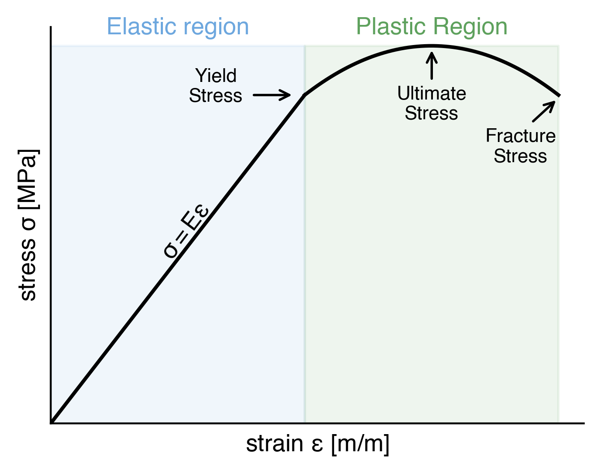

## Glossary

### Material Properties

- $\rho$: Layer density [$\mathrm{kg/m^3}$].

- $x$: Layer thickness [$\mathrm{m}$].

- $\alpha$: Material- and frequency dependent attenuation coefficient [$\mathrm{dB/MHz^\gamma\,cm}$]. It describes the two attenuation-parameters, absorption and scattering, in a single number. $\gamma$ is represented by `alpha_power` in the simulation parameters.

- $E$: Young's modulus [$\mathrm{Pa}$], the ratio between stress and strain in the linear elastic region, see Fig 1. Colloqiually known as stiffness.

<figure>

<figcaption align = "center"><b>Fig. 1: Schematic stress-strain curve. Young's modulus $E$ is the slope of the curve in the linear elastic region</b></figcaption>
</figure>

---

### Simulation properties

- `Nx`: Number of grid points (or nodes) in the x (row) direction. The higher it is, the more granular the resulting simulation. Conversely, one must also consider that the higher the number of nodes, the more computationally intensive the simulation.

- `cfl`: Courant-Friedrichs-Lewy number ensures convergence of the numerical PDE underlying the simulation. Mathematically it is described as

$$
c = \frac{u\Delta t}{\Delta x} 
$$

&nbsp;&nbsp;&nbsp;&nbsp;&nbsp;&nbsp; where $u$ denotes (layer-dependent) velocity, $\Delta t$ the interval between adjacent simulation timesteps, and $\Delta x$ is the distance between nodes, in our case a constant since the grid is regularly spaced.

- `simulation duration`: Duration of simulation [s]. The order of magnitude for battery simulations will typically be on the order of $\mathrm{\mu s}$

- `source_freq`: The excitement or driving frequency [Hz]. For battery simulations this number will typically be in the MHz range.

- `source_mag`: The magnitude of the driving force [Pa].

- `alpha_power`: Attenuation power, see $\alpha$ definition in material properties. To keep the user-input simple, this is used as a constant across all layers. It can easily be modified to be layer-dependent.